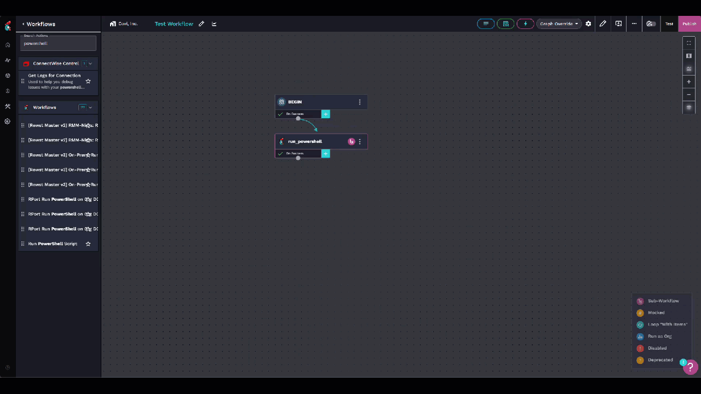
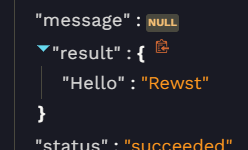

# Overview

Use this project and workflow to run raw PowerShell scripts directly in Azure Functions, rather than against a computer.

# Setup

1. Fork this repository.
1. Create a Function App in Azure. You'll need to name it something unique to your organization. I'd recommend using PowerShell Core and Linux as your operating system.
1. In your Function App in Azure, go to **Deployment Center** and connect it to the forked GitHub repository.
1. In Overview, copy your URL. We'll use this later to setup our Custom Integration. It will look like the following: https://functionappname.azurewebsites.net/api/run.
1. Navigate to your function app in Azure, then go to Overview. Under functions, click **ScriptRunner**.
1. Under Function Keys, copy your default key. We'll also be using this in the Custom Integration.
1. In Rewst, navigate to Configuration > Integrations > Custom Integrations. Add a new one called "Rewst PowerShell" and match the settings below:

    | Hostname                          	| API Key            	| Authentication Method 	| API Key Header Name 	|
    |-----------------------------------	|--------------------	|-----------------------	|---------------------	|
    | yourfunctionapp.azurewebsites.net 	| The key you copied 	| API Key               	| x-functions-key     	|

1. Import the `run-powershell.bundle.json` file as a new workflow.
1. In the `run_script` action under Advanced, you may need to add an Integration Override for your new Rewst PowerShell integration as well and then click publish.

# Usage

1. Create a script in Rewst called **Write-HelloRewst** with the following content:

```
'{{ CTX.hello }}' | ConvertFrom-JSON
```

Note that single quotes are important for passing objects since Rewst's `json_dump` filter will use double-quotes in the resulting string.

2. In a workflow on your BEGIN step, create a data alias called **hello** with the following value:

```
{{
    {
        "Hello": "Rewst"
    } |json_dump
}}
```

3. Add an action for the **Run PowerShell** workflow with your **Write-HelloRewst** as the script.

4. Test the workflow.



5. Notice that the result is returned as an object:



If you wanted to work with just strings, you could of course make your *hello* variable's value simply be {{ "world" }}. Then in your script, you'd just have the following:

```
"{{ CTX.hello }}"
```

If you're familiar with PowerShell, you may have noticed that we're able to get our output without doing anything explicit, such as posting data to a URL like in the Rewst example where we run scripts against endpoints. Because this is running directly in Azure as an API supported by PowerShell, we're able to return the full output of your script with REST, so anything that gets outputed in your script will be returned back to `{{ RESULT.result }}` automatically, just like a regular PowerShell script in your terminal.

In my testing, this means you can run almost anything that can run in Azure Functions. One example would be authenticating against resources in Azure by giving Azure Functions a Managed Identity.

# Avanan Example

I have not tested posting data, yet! If you try it, you'll want to pass your body like this:

```
{{
    {
        "foo": "bar"
    } | json_dump
}}
```

1. Add the following as default organization variables:
    - `avanan_app_id`
    - `avanan_app_secret`
1. Add the `Invoke-AvananRestMethod.ps1` script in the examples folder to your scripts in Rewst.
1. Import the **avanan_rest_api.bundle.json** in the workflows folder.
1. Test the imported workflow. Per the standard results from the Avanan SmartAPI, you should have your tenant data in `{{ RESULT.result.responseData }}`.

# Input Support

Inputs are now supported. Rather than posting your entire script to the body (which you can still do), you can format your request like this:

```
{ 
    "input": {
        "something": {
            "foo": "bar"
        }
    },
    "script": "$something"
}
```

This eliminates the need to embed variables inside of the script and workarounds, such as converting JSON text back to an object for anything complex.

# Custom Functions and Modules

Azure Functions for PowerShell lets you bring modules in with the `requirements.psd1` file and inject your own startup code with `profile.ps1`.

If you'd like to add Microsoft Graph, for example, you'd create your own `requirements.psd1` file that looked something like this:

```
@{
    'Microsoft.Graph' = '2.3.0'
}
```

Be careful, though, as this adds a lot of time to the startup process. It's a better practice to only import the submodules you need, like `Microsoft.Graph.Authentication`.

For custom functions, you can place whatever you want in `profile.ps1`, including functions that you'd like available in your code. In my personal repository, for example, I have the following to mimic the Secrets Management module's `Get-Secret` function:

```
# Azure Functions profile.ps1

# Authenticate with Azure PowerShell using MSI.
# Remove this if you are not planning on using MSI or Azure PowerShell.
if ($env:MSI_SECRET) {
    $ExpirationDate = $null
    $AccessToken = $null

    function Get-Secret {
        param(
            [Parameter(Mandatory = $true)]
            [string]$Name,

            # This is just for compatibility with the existing code
            [Parameter()]
            [switch]$AsPlainText
        )

        if($null -eq $AccessToken -or $ExpirationDate -lt (Get-Date)) {
            $Params = @{
                Uri     = "$env:MSI_ENDPOINT`?resource=https://vault.azure.net&api-version=2017-09-01"
                Method  = 'GET'
                Headers = @{ Secret = $env:MSI_SECRET }
            }

            $AuthResponse = (Invoke-RestMethod @Params)
            $AccessToken = $AuthResponse.access_token
            $ExpirationDate = $AuthResponse.expires_on -as [DateTime]
        }

        # Key Vault details
        $KeyVaultName = "MyKeyVault"  # Replace with your Key Vault name
        $SecretUri = "https://$KeyVaultName.vault.azure.net/secrets/$Name"

        # Retrieve secret using the access token
        $SecretParams = @{
            Uri     = $SecretUri
            Method  = 'GET'
            Body    = @{'api-version' = '7.4' }
            Headers = @{
                'Authorization' = "Bearer $AccessToken"
                'Content-Type'  = 'application/json'
            }
        }

        $SecretResponse = Invoke-RestMethod @SecretParams

        # Extract the secret value
        $SecretResponse.value
    }
}
```

For this to work, you'll need to enable Identity on your Azure Function and give it permissions to your Key Vault.

This allows me to use almost all of my personal scripts with no changes using RewstPS.