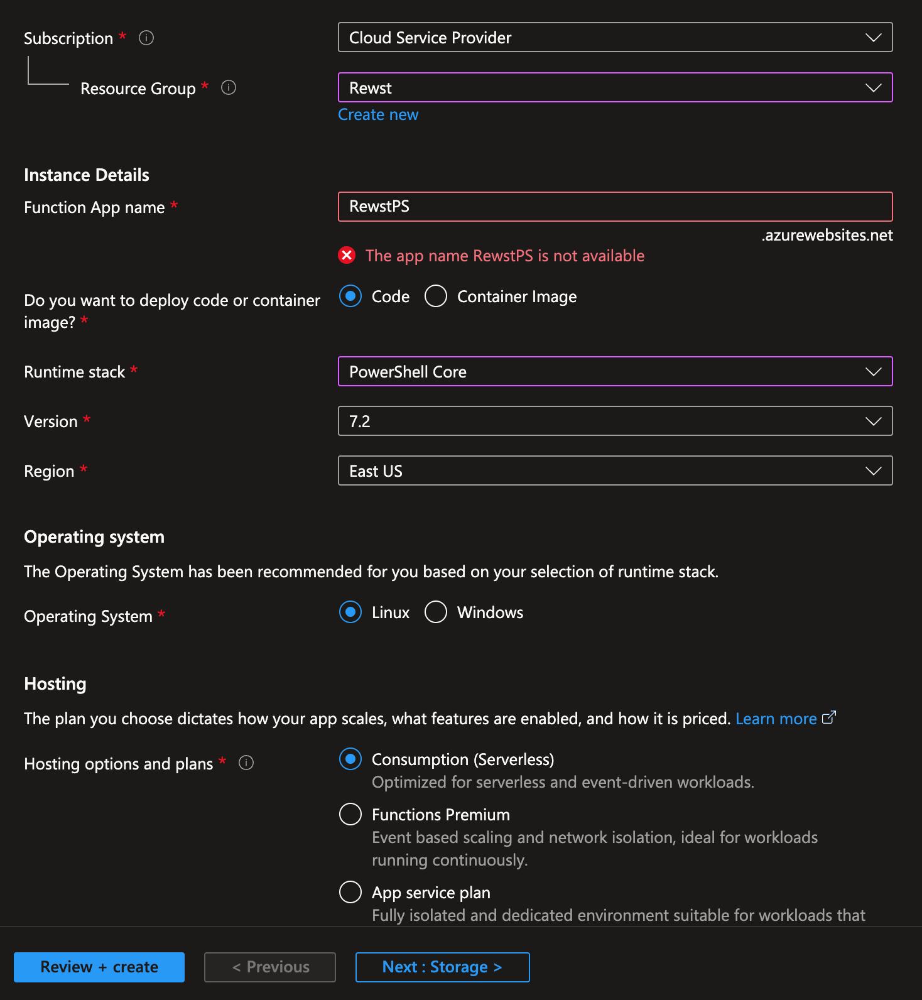

# Overview

Use this project and workflow to run raw PowerShell scripts directly in Azure Functions, rather than against a computer.

# Setup

1. Fork this repository.
1. Create a Function App in Azure. You'll need to name it something unique to your organization.

    

    Note: I have not tested this in Windows, but I'm sure it'll work just fine.

1. In your Function App in Azure, go to **Deployment Center** and connect it to the forked GitHub repository.
1. In Overview, copy your URL. You'll want to use this to create a default org variable in Rewst called `rewstps_az_functions_url`. The full URL if you want to test this outside of Rewst is: https://functionappname.azurewebsites.net/api/run.function/api/run.
1. Navigate to your function app in Azure, then go to Overview. Under functions, click **ScriptRunner**.
1. Under Function Keys, copy your default key and put it in another default org variable named `rewstps_az_functions_key`.
1. Import the `run-powershell-script.bundle.json` file as a new workflow.

# Usage

1. Create a script in Rewst called **Write-HelloRewst** with the following content:

```
'{{ CTX.hello }}' | ConvertFrom-JSON
```

Note that single quotes are important for passing objects since Rewst's `json_dump` filter will use double-quotes in the resulting string.

2. In a workflow on your BEGIN step, create a data alias called **hello** with the following value:

```
{{
    {
        "Hello": "Rewst"
    } |json_dump
}}
```

3. Add an action for the **Run PowerShell** workflow with your **Write-HelloRewst** as the script.

4. Test the workflow.


5. Notice that the result is returned as an object:


If you wanted to work with just strings, you could of course make your *hello* variable's value simply be {{ "world" }}. Then in your script, you'd just have the following:

```
"{{ CTX.hello }}"
```

If you're familiar with PowerShell, you may have noticed that we're able to get our output without doing anything explicit, such as posting data to a URL like in the Rewst example where we run scripts against endpoints. Because this is running directly in Azure as an API supported by PowerShell, we're able to return the full output of your script with REST, so anything that gets outputed in your script will be returned back to `{{ RESULT.result }}` automatically, just like a regular PowerShell script in your terminal.

In my testing, this means you can run almost anything that can run in Azure Functions. One example would be authenticating against resources in Azure by giving Azure Functions a Managed Identity.

# Avanan Example

# Usage

I originally wrote this to create Avanan signatures, but it should work with any script. Here's a screenshot of my `Get-AvananSignature` script in Rewst:

```
$Request = "{{ CTX.request }}"
$Base64Signature = [System.Convert]::ToBase64String([System.Text.Encoding]::UTF8.GetBytes($Request))
$Hash = [System.Security.Cryptography.HashAlgorithm]::Create('sha256').ComputeHash([System.Text.Encoding]::UTF8.GetBytes($Base64Signature))
([System.BitConverter]::ToString($Hash).Replace('-', '').ToLower())
```

This script takes the `CTX.request` variable, converts it to base64, then hashes it with sha256. The hashing part is something that Rewst can't currently do.

I then created a workflow called **Get Avanan Signature** (bundle available in the workflows folder). This does the following:

1. Creates a new `CTX.request` variable with the following Jinja:

    ```
    {{ (CTX.request_id + ORG.VARIABLES.avanan_app_id + CTX.request_date + CTX.request_text + ORG.VARIABLES.avanan_app_secret) }}
    ```

    Note that I have my `avanan_app_id` and `avanan_app_secret` as default org variables.

2. Runs the **Run PowerShell Script** subworkflow with your **Get-AvananScript** script. Note that you may need to change this to your script in your **Get Avanan Signature** workflow.

In the subworkflow, you'll notice that results are returned `RESULT.result.response`, so if you want to try this in Postman, you can expect anything that your PowerShell script returns as output to be delivered like the following:

```
{
    "response": "Hello World"
}
```

Additionally, if your result is an object, it'll return as an object. Example:

```
{
    "response": {
        "foo": "bar"
    }
}
```