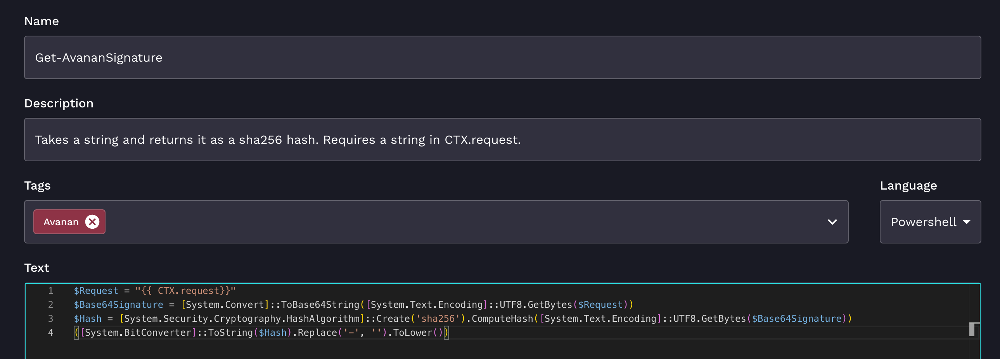

# Overview

Use this project and workflow to run raw PowerShell scripts directly in Azure Functions, rather than against a computer.

# Setup

1. Create a Function App in Azure. You'll need to name it something unique to your organization.

    

1. Deploy this Azure Function to Azure using [Azure Functions Core Tools](https://learn.microsoft.com/en-us/azure/azure-functions/functions-run-local?tabs=macos%2Cisolated-process%2Cnode-v4%2Cpython-v2%2Chttp-trigger%2Ccontainer-apps&pivots=programming-language-powershell#publish)

    Note: I have not tested this in Windows, but I'm sure it'll work just fine.

    ```
    func azure functionapp publish RewstPS
    ```

    You'll get a url as output that looks like the following:
    `https://yourappname.azurewebsites.net/api/run`. 

    Put this URL in an org variable named `rewstps_az_functions_url`.

1. Navigate to your function app in Azure, then go to Overview. Under functions, click `ScriptRunner`.
1. Under Function Keys, copy your default key and put it in another org variable named `rewstps_az_functions_key`.
1. Import the `run-powershell-script.bundle.json` file as a new workflow.

# Usage

I originally wrote this to create Avanan signatures, but it should work with any script. Here's a screenshot of my `Get-AvananSignature` script in Rewst:



```
$Request = "{{ CTX.request}}"
$Base64Signature = [System.Convert]::ToBase64String([System.Text.Encoding]::UTF8.GetBytes($Request))
$Hash = [System.Security.Cryptography.HashAlgorithm]::Create('sha256').ComputeHash([System.Text.Encoding]::UTF8.GetBytes($Base64Signature))
([System.BitConverter]::ToString($Hash).Replace('-', '').ToLower())
```

This script takes the `CTX.request` variable, converts it to base64, then hashes it with sha256. The hashing part is something that Rewst can't currently do, which I needed to overcome.

I then created a workflow called `Get Avanan Signature` (bundle available in the workflows folder). This does the following:

1. Creates a new `CTX.request` variable with the following Jinja:

    ```
    {{ (CTX.request_id + ORG.VARIABLES.avanan_app_id + CTX.request_date + CTX.request_text + ORG.VARIABLES.avanan_app_secret) }}
    ```

    Note that I have my `avanan_app_id` and `avanan_app_secret` as org variables.

2. Runs the `Run PowerShell Script` subworkflow with your `Get-AvananScript` script.

In the subworkflow, you'll notice that results are returned `RESULT.result.response`, so if you want to try this in Postman, you can expect anything that your PowerShell script returns as output to be delivered like the following:

```
{
    "response": "Hello World"
}
```

Additionally, if your result is an object, it'll return as an object. Example:

```
{
    "response": {
        "foo": "bar"
    }
}
``